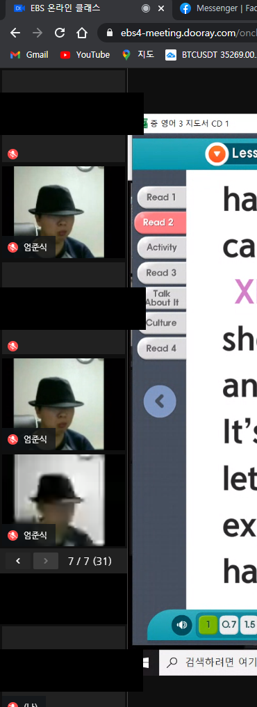

# SANGSANGBOT
온라인 클래스 실시간 쌍방향 수업 테러 봇

## 목차

- [기능](#기능)
- [할일](#할일)

----

# 기능

원하는 실시간 수업에 봇을 원하는만큼 넣을 수 있습니다.

- 봇 이름 설정
- 봇 개수 설정
- 이외에 봇 로그인 관련 옵션을 설정할 수 있습니다.

### config.ini
	link =  실시간 쌍방향 수업 링크
	name =  봇 이름
	count = 만들 봇 개수
  
	나머지 옵션은 온라인클래스 실시간 쌍방향 수업 사이트 구조에 대한 이해가 있으신분들이 아니라면 기본 옵션으로 두시는걸 추천합니다.
	
## 사용 화면 캡쳐

### 엄준식, 참석 로그 도배
 

# 할일

- [ ] 채팅 기능추가
- [ ] 캠 기능추가
- [ ] 자동 입장 코드 수정 **중요**

## 주의

- 재미삼아 만들어보았습니다.
- **본 코드로 인해 일어나는 불이익은 책임지지 않습니다.**
- 코드가 지저분합니다.
- (신) 중학교 EBS온라인클래스에서만 테스트 되었습니다.

## 정보

- python 3
- selenium , configparser , random 사용
